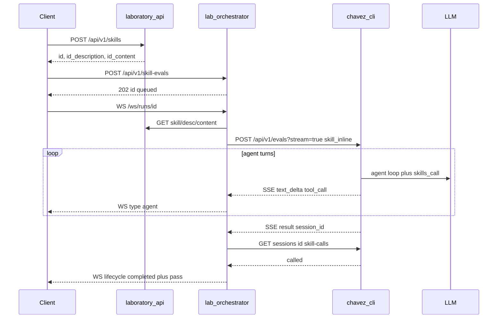

# Objetivo del laboratorio

Este repositorio es un **laboratorio de skills**: crear una skill versionada (name, description, content), ejecutar un eval orquestado contra un agente LLM, y **comprobar si el modelo invocó esa skill** vía la tool `skills_call`.

El resultado de producto no es solo persistir skills ni correr un chat: es medir el **trigger** — `pass=true` cuando el orquestador confirma vía `GET .../skill-calls` que hubo `skills_call` con el nombre de la skill bajo prueba.

Los evals de laboratorio (skill-eval, trigger-eval batch, baseline, optimize train/validation) son **analysis-only**: no ejecutan el cuerpo del skill ni crean archivos, aunque SKILL.md lo pida. Chavez `eval_mode=trigger` es la garantía.

Roles de cada servicio: [`services/AGENTS.md`](../../services/AGENTS.md). Cómo correr el flujo: [`skill-eval-e2e.md`](skill-eval-e2e.md).

## Flujo objetivo

## Criterio de éxito

| Condición | Significado |
|-----------|-------------|
| `skill-evals.status=completed` y `pass=true` | `GET skill-calls` reportó `called=true` para el skill |
| `completed` y `pass=false` | El run terminó, pero el LLM no llamó esa skill |
| `failed` | Error de infra (Lab API, Chavez, timeout, skill-calls); ver `error` |

El cliente crea la skill en laboratory-api, encola el eval en el orchestrator (`POST`) y observa progreso por WebSocket (`GET /ws/runs/{id}`): eventos `type=lifecycle` (estado/`pass`) y `type=agent` (stream de chavez). El poll HTTP solo trae lifecycle. No hay auto-trigger al crear la skill. El orquestador calcula `pass` desde skill-calls persistidos en chavez, no desde el `pass` del POST eval.
