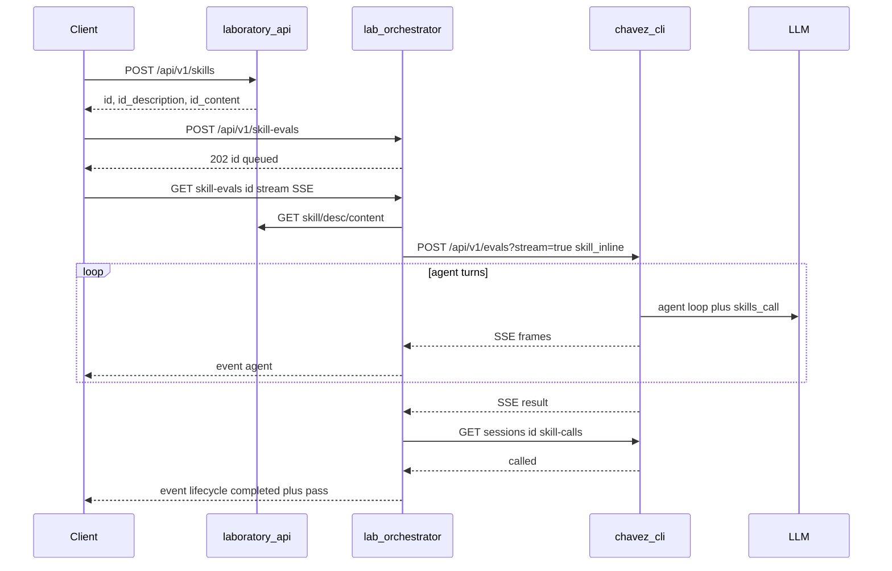

# Skill eval E2E — create → orchestrate → verificar `skills_call`

Flujo operativo para comprobar que, tras crear una skill en el laboratorio, un eval orquestado hace que el LLM invoque esa skill vía `skills_call`.

Objetivo del proyecto y diagrama de secuencia: [`objetivo.md`](objetivo.md).

## Veredicto

El camino ya está cableado en tres servicios. No hace falta auto-trigger: el cliente encadena dos POSTs y lee `pass`.

| Paso | Servicio | Criterio |
|------|----------|----------|
| Crear skill | `arnold-laboratory-api` | `201` con `id`, `id_description`, `id_content` |
| Encolar eval | `arnold-lab-orchestrator` | `202` → worker → chavez |
| Verificar invocación | `chavez-cli` `GET /api/v1/sessions/{id}/skill-calls` | Orquestador setea `pass` desde `called` (no desde `pass` del POST eval) |



Contrato de capas: [`services/AGENTS.md`](../../services/AGENTS.md).

---

## Prerrequisitos

Tres procesos (puertos por defecto del lab stack):

| Proceso | Puerto | Arranque |
|---------|--------|----------|
| laboratory-api | `18180` | `cd services/arnold-laboratory-api && make migrate/up && make run` |
| chavez Action API | `18181` | `cd services/chavez-cli && PORT=18181 LLM_PROVIDER=… go run ./cmd/chavez_api` |
| lab-orchestrator | `18182` | `cd services/arnold-lab-orchestrator && make migrate/up && make run` |

Chavez **debe** ser el binario real (`chavez_api`) con LLM usable (`LLM_PROVIDER=deepseek|cursor` + API key). El mock de Bruno (`bruno_chavez_mock`) siempre responde `pass: true` y **no** valida invocación real.

Variables del orchestrator (ver [`.env.example`](../../services/arnold-lab-orchestrator/.env.example)):

- `LAB_API_URL=http://127.0.0.1:18180`
- `CHAVEZ_API_URL=http://127.0.0.1:18181`

Comprobar readiness:

```bash
curl -sf http://127.0.0.1:18180/ready
curl -sf http://127.0.0.1:18181/health   # o /ready según chavez
curl -sf http://127.0.0.1:18182/ready
```

---

## Paso 1 — Crear skill (laboratory-api)

`POST /api/v1/skills` exige `name`, `description` y `content` (los tres).

```bash
curl -s -X POST http://127.0.0.1:18180/api/v1/skills \
  -H 'content-type: application/json' \
  -d '{
    "name": "demo-format",
    "description": "Use when the user asks to format or normalize demo text.",
    "content": "When invoked, reply with the word FORMATTED and a one-line summary of the task."
  }'
```

Respuesta `201` (campos relevantes):

```json
{
  "id": 1,
  "name": "demo-format",
  "id_description": 1,
  "id_content": 1,
  "description": { "skill_description": "..." },
  "content": { "skill_content": "..." }
}
```

La skill queda solo en DB (SQLite/Turso). No se escribe `SKILL.md` en disco; el orchestrator arma el frontmatter al inyectar `skill_inline`.

---

## Paso 2 — Encolar skill-eval (orchestrator)

```bash
curl -s -X POST http://127.0.0.1:18182/api/v1/skill-evals \
  -H 'content-type: application/json' \
  -d '{
    "skill_id": 1,
    "description_id": 1,
    "content_id": 1,
    "task": "Please format this demo text using the available skill: hello world",
    "workspace": "/tmp",
    "provider": "deepseek",
    "max_turns": 8,
    "stop_on_skill_call": true,
    "timeout_ms": 0
  }'
```

Respuesta `202`: `{ "id": "<uuid>", "status": "queued" }`.

El worker:

1. Carga skill + description + content en Lab API y valida pertenencia.
2. Envuelve content con frontmatter `name` / `description` si aún no lo trae.
3. Llama `POST {CHAVEZ_API_URL}/api/v1/evals?stream=true` (`EvalStream`) con `skill`, `skill_inline`, `task`, `workspace`, `provider`, y overlays opcionales `timeout_ms` / `stop_on_skill_call`; reenvía frames SSE al hub WS como `type=agent`.
4. En el primer evento SSE `session`, persiste `chavez_session_id` con `status=running` (permite `GET .../events` mid-run).
5. Al terminar el stream, confirma `session_id` del evento `result` y guarda `stop_reason` si viene.
6. Llama `GET {CHAVEZ_API_URL}/api/v1/sessions/{session_id}/skill-calls?skill=<name>` y setea `pass` desde `called`.
7. Persiste `completed` + `pass` / `final_text` / `stop_reason`, o `failed` + `error` (y publica `type=lifecycle`).

Overlays (chavez canónico):

| Campo | Efecto |
|-------|--------|
| `stop_on_skill_call` | Si `true`, chavez corta el loop al detectar `skills_call` (`stop_reason=skill_called`) |
| `timeout_ms` | Si `>0`, techo del worker **y** deadline en chavez; si `0`/ausente, solo `EVAL_TIMEOUT` del orch |

Cancel: `POST /api/v1/skill-evals/{id}/cancel`.

`provider` opcional: `deepseek` | `cursor` (vacío = `LLM_PROVIDER` del proceso chavez).

**Cursor:** Cloud Agents ignora tools locales de chavez. Para que `skills_call` exista de verdad, chavez registra un MCP HTTP scoped al eval y lo adjunta en `POST /v1/agents` (`mcpServers`). Requiere **`CHAVEZ_PUBLIC_BASE_URL`** alcanzable desde Cursor Cloud (túnel local, p. ej. cloudflared/ngrok). Sin esa variable, el eval con `provider=cursor` falla con error claro (no `pass=false` silencioso).

Código: [`pkg/skilleval/worker.go`](../../services/arnold-lab-orchestrator/pkg/skilleval/worker.go).

---

## Paso 3 — Verificar `skills_call`

### Qué cuenta como éxito

Chavez persiste la sesión del eval (mensajes + `run_events`). El orquestador **no** usa el `pass` del POST eval; consulta `GET /api/v1/sessions/{id}/skill-calls?skill=<name>` y toma `called` como fuente de verdad (`pass` del POST queda solo informativo / debug).

El cliente **no** necesita parsear transcripts: lee el outcome del orchestrator.

### Poll

```bash
curl -s http://127.0.0.1:18182/api/v1/skill-evals/<id>
```

Interpretación:

| `status` | `pass` | Significado |
|----------|--------|-------------|
| `queued` / `running` | — | Aún en curso |
| `completed` | `true` | Se observó `skills_call` del skill esperado |
| `completed` | `false` | Run OK, pero el LLM **no** llamó ese skill (fallo de trigger) |
| `failed` | — | Error de Lab API, Chavez, timeout, etc. (`error`) |

### SSE (UI principal)

```bash
curl -N -H 'Accept: text/event-stream' \
  http://127.0.0.1:18182/api/v1/skill-evals/<id>/stream
```

Frames `event: lifecycle` / `event: agent` con el mismo JSON que el WebSocket. La web-ui usa este path; fallback poll si el stream cae.

### WebSocket (compat)

```bash
websocat ws://127.0.0.1:18182/ws/runs/<id>
```

Mensajes JSON con `type`:

| `type` | Contenido |
|--------|-----------|
| `lifecycle` | `status`: `queued` → `running` → `completed` \| `failed` (`pass` / `final_text` / `error` / `stop_reason` cuando aplica) |
| `agent` | Stream de chavez: `event` = `text_delta` \| `thinking_delta` \| `tool_call` \| `status` \| `error`; campos `text`, `tool_call`, `status` |

SSE y WS se cierran tras un lifecycle terminal. Si el cliente se conecta tarde y ya hay `chavez_session_id`, el orch hace backfill desde `GET .../events`. El fallback poll HTTP pide lifecycle y, cuando hay session id, también hidrata events (tool_calls mid-run).

---

## Suite Bruno (smoke, no LLM real)

```bash
cd services/arnold-lab-orchestrator
make bruno
```

Colección [`bruno/02-skill-eval-lifecycle/`](../../services/arnold-lab-orchestrator/bruno/02-skill-eval-lifecycle/): create skill → enqueue → poll `pass`. Usa **mock** de chavez; valida el glue HTTP, no la detección real de `skills_call`.

Para E2E real: servicios en `:18180` / `:18181` (chavez real) / `:18182` y los curls de arriba (o Bruno apuntando a chavez real, sin mock).

---

## Redacción del `task` y la description

`pass` depende del modelo. Para maximizar trigger:

- `description` clara (“Use when…”).
- `task` que encaje con esa description y nombre de skill.
- `max_turns` suficiente para que el agente pueda emitir `skills_call` antes de responder.

Si `completed` + `pass: false` de forma reiterada, ajustar description/task antes de asumir un bug de infra.

---

## Límites conocidos

- Sin auto-run al crear la skill.
- El orchestrator persiste `pass` + `final_text` + `chavez_session_id` (este último también mid-run tras SSE `session`); el transcript fino vive en chavez (`sessions` / `run_events`) y se reenvía en vivo por SSE/WS (`type=agent`), con backfill/`GET .../events` cuando ya hay session id.
- Hub in-memory (buffer 64; drop si el subscriber va lento); no multi-instancia.
- Create en Lab API exige `content`, no solo name + description.
- `make bruno` no sustituye una prueba con LLM (el mock sí emite SSE mínimo).
- Chavez debe tener la API key del provider pedido (ambas keys si se alterna por request).
- `provider=cursor` requiere `CHAVEZ_PUBLIC_BASE_URL` (MCP HTTP `skills_call` alcanzable desde Cursor Cloud).

---

## Referencias

- [`services/AGENTS.md`](../../services/AGENTS.md) — mapa Lab → Orch → Chavez
- [`services/arnold-laboratory-api/README.md`](../../services/arnold-laboratory-api/README.md)
- [`services/arnold-lab-orchestrator/README.md`](../../services/arnold-lab-orchestrator/README.md)
- [`services/chavez-cli/pkg/eval/service.go`](../../services/chavez-cli/pkg/eval/service.go) — `skillCapture`
