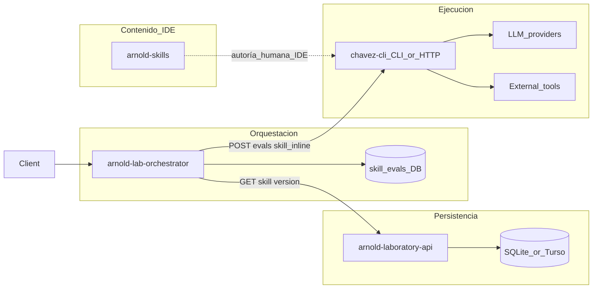

# AGENTS.md — capa de servicios

Arquitectura **objetivo** de `services/` y razón de existir de cada repo. No es un inventario del código tal cual hoy; el detalle operativo (Make, endpoints, convenciones) vive en el README/AGENTS de cada servicio.

## Mapa de repos

| Repo | Razón de existir | Hace | No hace |
|------|------------------|------|---------|
| [`arnold-laboratory-api`](arnold-laboratory-api/) | Fuente de verdad persistente de skills de laboratorio (CRUD versionado) | HTTP + DB (skills, descriptions, contents) | LLMs, tools externas, loops de agente, evals de ejecución |
| [`chavez-cli`](chavez-cli/) | Runtime ejecutable: CLI y/o Action API HTTP que corre LLMs y tools | Llamadas a LLM, tools, skills en runtime (incl. `skill_inline`), capas de comportamiento según flags/endpoints | Persistencia canónica del catálogo de skills de laboratorio; historial de evals de lab |
| [`arnold-lab-orchestrator`](arnold-lab-orchestrator/) | Glue async: setup de versión de skill + eval streaming en chavez + WS lifecycle/agent | Persiste runs `skill_evals`, llama Lab API + Chavez SSE, WebSocket lifecycle + agent frames | Contenido canónico de skills; loop de agente |
| [`arnold-skills`](arnold-skills/) | Catálogo/orquestación de skills de producto para Cursor/IDE | Contenido de skills y agentes | Backend HTTP, persistencia de lab, runtime de LLM |

```text
  arnold-skills             → autoría / catálogo Cursor (contenido IDE)
  arnold-laboratory-api     → persistencia versionada de skills de lab (HTTP + DB)
  chavez-cli                → ejecución: LLM + tools + capas por flags/endpoints
  arnold-lab-orchestrator   → orquesta eval async Lab → Chavez + WS
```



Objetivo de producto del lab (create skill → eval → verificar `skills_call`): [`docs/architecture/objetivo.md`](../docs/architecture/objetivo.md).

## arnold-laboratory-api — solo persistencia

**Contrato:** única responsabilidad = persistencia de datos del laboratorio (skills con descriptions y contents versionados).

- Capa HTTP delgada: handler → service → repository.
- No ejecutar LLMs, tools externas, tool hooks ni lógica de “stop on skill”.
- Guía operativa (layout, Make, endpoints, sqlc/goose): [`arnold-laboratory-api/AGENTS.md`](arnold-laboratory-api/AGENTS.md).

## chavez-cli — CLI / HTTP client con capas de ejecución

**Razón de existir:** runtime que puede hablar con LLMs y tools externas, expuesto como CLI local o como Action API HTTP (misma fachada de acciones; p. ej. `chavez_api` / `-api-url`).

### Capas de comportamiento

Activadas por **flags CLI** o **endpoints HTTP**, apilables conceptualmente:

1. **Base — LLM + tools:** loop agente (chat → tools → repeat) y catálogo de tools externas.
2. **Skill-gate:** si se invoca una skill predefinida (p. ej. vía `skills_call` / política del flag o endpoint), **detener** o cortocircuitar el flujo según el contrato del modo (útil para evals de trigger / laboratorios). Observación vía `POST /api/v1/evals` (soporta `skill_inline`; persiste sesión) y verificación canónica vía `GET /api/v1/sessions/{id}/skill-calls`.
3. **Wrap / post-LLM:** lógica encima o alrededor del calling al LLM (hooks, instrumentación, wrappers de eval, persistencia de sesión de runtime).

```text
request (flag | endpoint)
    → [wrap / hooks opcionales]
    → LLM call
    → tools / skills
    → si skill-gate dispara → STOP (según modo)
    → si no → continuar loop / respuesta
```

Al añadir flags o endpoints, documentar qué capa activan (`base` / `skill-gate` / `wrap`).

### Persistencia en chavez

Solo lo necesario para **runtime** (p. ej. sesiones de chat). La fuente de verdad de skills de laboratorio permanece en `arnold-laboratory-api`.

## arnold-lab-orchestrator — glue de evals de lab

**Contrato:** encolar un eval async dada una versión concreta (`skill_id` + `description_id` + `content_id`), materializar la skill en memoria vía chavez `skill_inline` con `POST .../evals?stream=true`, verificar invocación con `GET .../skill-calls`, persistir outcome y emitir WebSocket: `type=lifecycle` (`queued` → `running` → `completed|failed`) y `type=agent` (frames SSE de chavez).

- No es dueño del CRUD de skills ni del loop LLM.
- Guía operativa: [`arnold-lab-orchestrator/AGENTS.md`](arnold-lab-orchestrator/AGENTS.md).
- Flujo E2E create skill → eval → verificar `skills_call` (`pass`): [`docs/architecture/skill-eval-e2e.md`](../docs/architecture/skill-eval-e2e.md).

## arnold-skills — catálogo IDE

Existe para autoría y distribución de skills de producto en el ecosistema Cursor. No es un servicio Go de lab: no sustituye el CRUD de laboratory-api ni el runtime de chavez.

## Do not

- No meter LLM ni tools en `arnold-laboratory-api`.
- No convertir `chavez-cli` en almacén canónico de skills de laboratorio.
- No mezclar responsabilidades de `arnold-skills` (contenido IDE) con persistencia de lab o Action API.
- No absorber CRUD de skills ni el agent loop dentro de `arnold-lab-orchestrator`.
- No inventar responsabilidades cruzadas sin actualizar este documento.
